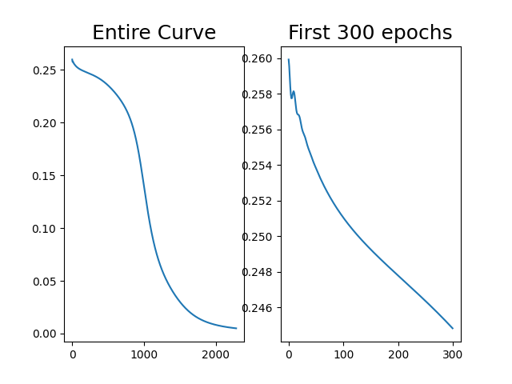
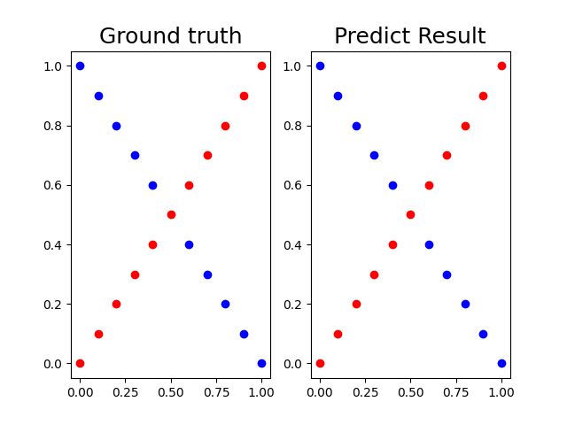
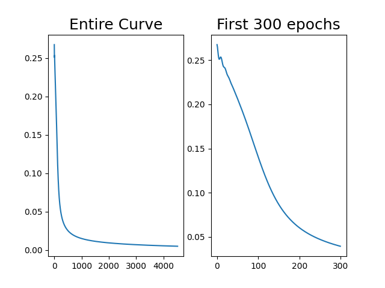
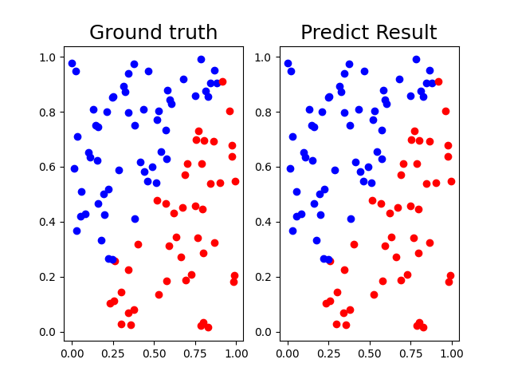

# Lab1: Backpropagation

- Implement MLP(w/ three linear layers) by using Numpy. 
- Deep Learning Framework(ex: Pytorch) is not allowed. 

### Usage

```
python train.py --loss [MSE/CE] --lr 0.1 --data [xor/linear] --momentum 0.9 --seed 1  --target_loss 0.005

```
- loss: Mean Square Error / Cross Entropy
- data: xor/linear data
- target_loss: while loss is smaller than target loss, training process will stop

### Result
Run run.sh to get experiment result.
##### parameter setting
- Loss: MSE 
- LR: 0.1
- Momentum: 0.9
- Target Loss: 0.005

#### (1) XOR
- ##### Loss curve


- ##### Result



#### (2) Linear
- ##### Loss curve


- ##### Result

 
