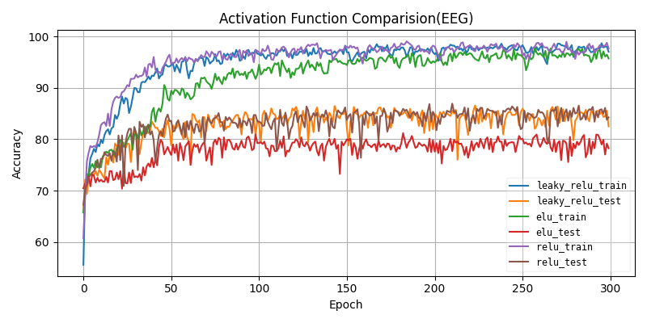
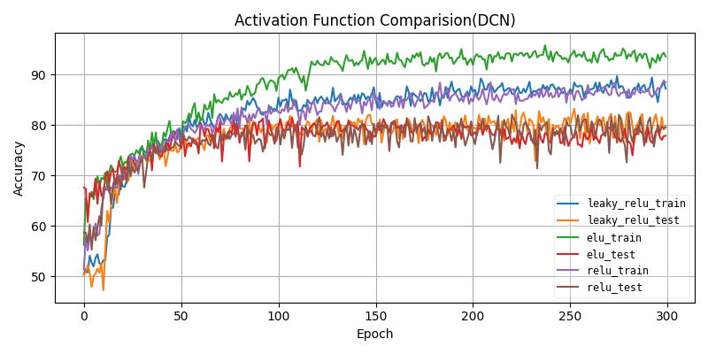
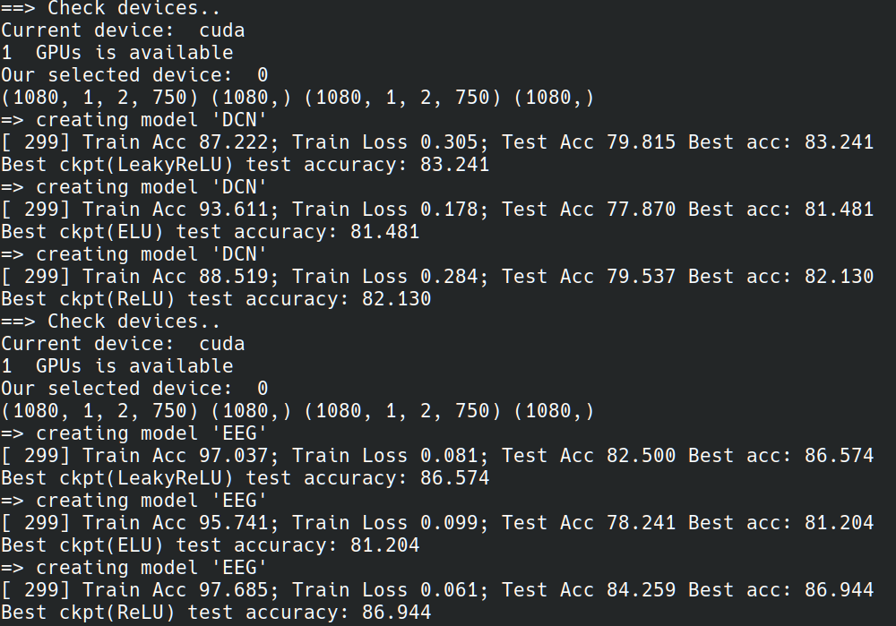

# Lab2: EEG Classififcation
- Use CNN to classify time series EEG data
- Dataset: BCI competition Dataset
- Model: EEGNet(EEG) / DeepConvNet(DCN)
- Three kinds of activation functions: ReLU, ELU, Leaky ReLU

## Train
Run training script to train 6 models (EEG/DCN + ReLU/ELU/Leaky ReLU).
```
./train.sh
```

## Test
- #####  Default setting is to test EEG model which uses Leaky ReLU as activation function.
```
./test.sh
```
- ##### If you want to change model to test, remember to change activation function and resume path.
```
python test.py -a [EEG/DCN] --gpu 0 --act [1/2/3] --resume [model_weight_path]
```
- a (--arch): choose architecture of model
- act: choose activation function of model {0: Relu, 1: Leaky ReLu, 2: ELU}

## Result
##### Run ./train.sh to get training curve and accuracy
### Training Curve
#### EEG

#### DCN

### Accuracy



