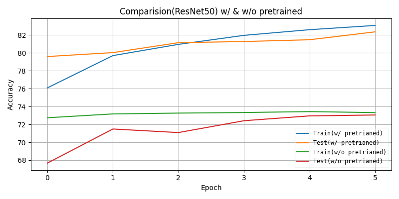
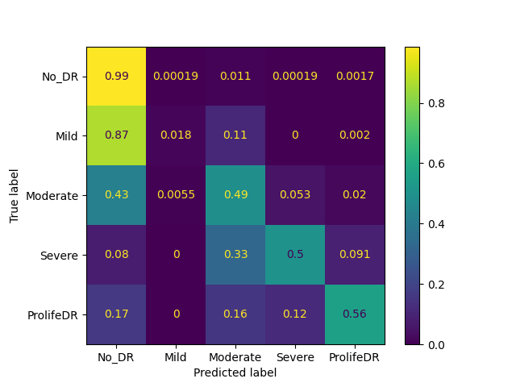
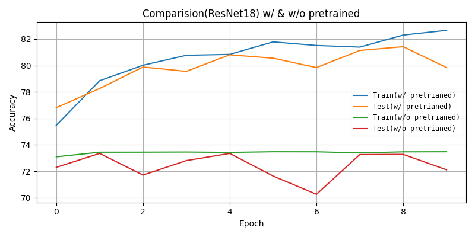
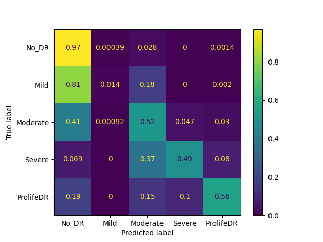

# DLP Lab3
- Train Diabetic Retinopathy data with Resnet18 & Resnet50
- Load data by using Custom Dataset
- Use Confusion Matrix (generate with sklearn) to evalute model 
- Try to build and realize ResNet architecture
### Directory Architecture
```
lab3
|--- train.py (Train & test with this code)
|--- train_iterate.sh (Sample code to train and draw training curve)
|--- test.sh (Sample code to test model)
|--- diy_resnet.py (diy version of resnet18/50)
|--- output.csv (Training and validation accuracy store in each row)
|--- plot_figure.py (Load output.csv first 8 rows to plot training curve)
|--- dataset.py (Custom dataset to load data)
|--- figure/ (Pre-generate training curve and confusion matrix)
|--- lab3_data
     |--- data/ (put all images to this dir.)
          |--- link.txt
     |--- test_img.csv
     |--- test_label.csv  
     |--- train_img.csv
     |--- train_label.csv
```
### Prepare data

The dataset contains 35124 images, we divided dataset into 28,099 training data and
7025 testing data. The image resolution is 512x512 and has been preprocessed.

### Train
```
python train.py -a <resnet18/resnet50> -j <number_workers> --epochs <epochs> -b <batch_size> --lr <lr> (--pretrained) --gpu <id> --patience <patience value> <dataset dir>
```
Every time using train.py to train or testing, program will generate confusion_matrix.png

Using **train_iterate.sh** can train resnet18/50 w/ & w/o pretrained weight, and then using plot_figure.py to plot accuracy curve.

### Testing
```
python train.py -a <resnet18/resnet50> -j <number_workers> -b <batch_size> --lr <lr> (--pretrained) --gpu <id> -e --resume <model_wieght_path> <dataset dir>
```
There is an example in **test.sh**.
### Result
Using train_iterate.sh to generate

#### Resnet 50
- Training Curve



- Confusion matrix of model which uses pretrained weight to train


#### Resnet 18
- Training Curve



- Confusion matrix of model which uses pretrained weight to train


