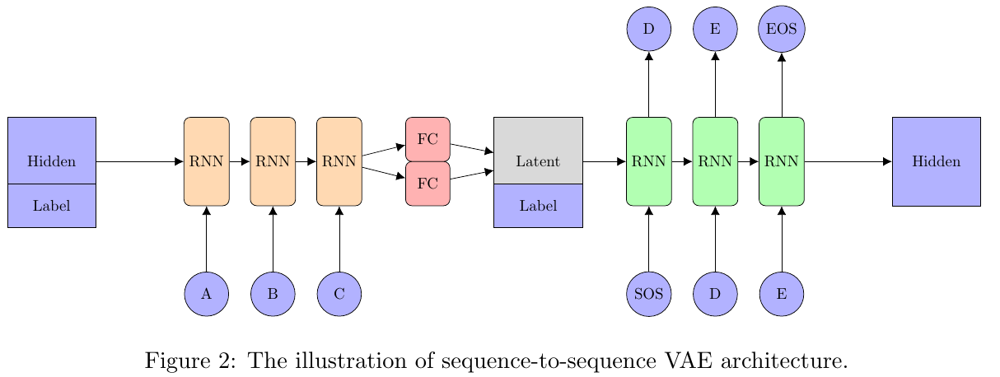
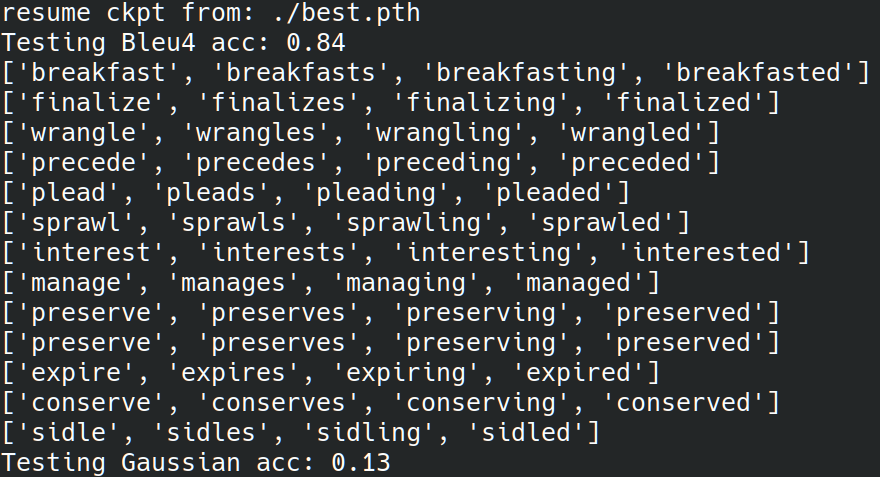

# Lab4 Condtional Sequence to Sequence VAE
In this lab, we need to implement Condtional Sequence to Sequence VAE for English tense conversion and generation.
- Tense Conversion: give input word, tense of word, and output tense. Model should have ability to generate the word with corresponding output tense.
- Generation: Give output condition and input gaussian noise to latent, decoder should generate a word with corresponding output tense.
- For example, when we input the input word ‘access’ with the tense (the condition)
‘simple present’ to the encoder, it will generate a latent vector z. Then, we take z with the tense
‘present progressive’ as the input for the decoder and we expect that the output word should be
‘accessing’. In addition, we can also manually generate a Gaussian noise vector and feed it with
different tenses to the decoder and generate a word those tenses.


There are two kind of testing:
- (1) Capability of tense conversion on testing data
    - Use testing data to test tense conversion with criterion BLUE-4 score
- (2) Capability of word generation.
    - Generate 100 gaussian noise + 4 tenses
    - Criterion: if model can generate words with correct 4 tenses then get 1 point.

## Usage:
### Training
```
python main.py
```
### Testing
```
python main.py -e --resume [model_weight_path]
Example-> python main.py -e --resume ./best.pth
```
### Result:



