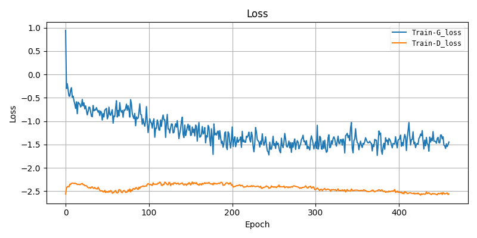

# Lab5 Conditional GANs
- Implement multi-labels(3 shape * 8 colors) conditional GANs
- One image at most contains 3 objects
- Implement ACGAN and WGAN-GP
### Usage
#### Train
```
python acgan.py/wgan_gp.py
```
Detailed setting can use ** --help ** to check
#### Test
```
python acgan.py/wgan_gp.py -e --resume [model_weight_path]
```
#### Plot Curve

Run plot_figure.py to generate loss and training curve.

```
python plot_figure.py --resume [model_weight_path]
```

### Result

Train wgan-gp w/ noise_ratio=0.15 and the best model was saved at epoch 461.

#### Training Curve




#### Testing Accuracy


#### Generated testing images

There are some noise inside generated images. This is a problem, which is probably caused by using noise_ration,of my generator. However, my generator indeed cheats TA's classifier.


### Acknowledge: Thanks for PyTorch-GAN repo provide implementations of many GAN papers.

